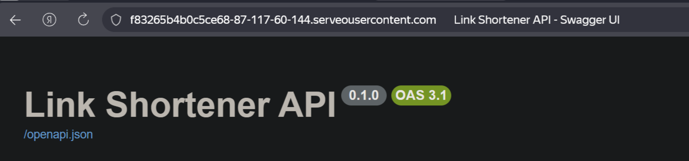

# 🔗 Link Shortener Service (FastAPI)

Асинхронный сервис для сокращения ссылок с авторизацией и поддержкой кэширования.

## 🌟 Основные возможности
* **Генерация коротких ссылок:** Создание уникальных идентификаторов для длинных URL.
* **Высокая производительность:** Использование **Redis** для мгновенного редиректа (кэширование).
* **Автоматическая очистка:** Фоновые задачи (Lifespan) для удаления устаревших ссылок (каждую минуту).
* **Динамический BASE_URL:** Сервис автоматически определяет хост (локальный или через туннель).
* **Контейнеризация:** Полный деплой через Docker Compose.

## 🛠 Технологический стек
* **Backend:** FastAPI (Python 3.12)
* **Database:** PostgreSQL (SQLAlchemy + Alembic)
* **Caching:** Redis
* **Infrastructure:** Docker, Docker Compose
* **Networking:** Serveo Tunnel (для демонстрации)

---

## 🚀 Быстрый запуск

### 1. Клонирование репозитория
```bash
git clone https://github.com/Markos61/LinkServiceProj.git
cd LinkServiceProj
```

### 2. Установка переменных окружения в .env файле
```bash
DB_HOST=localhost
DB_PORT=5432
DB_NAME=postgres - имя БД
DB_USER=postgres - имя Пользователя
DB_PASS=*** - пароль 
```

### 3. Запуск БД и Redis
```bash
docker-compose up -d --build
```
### 4. Запуск приложения
```bash
uvicorn main:app --host 127.0.0.1 --port 8000
```
### 5. Доступ из интернета 
```bash
C:\Windows\System32\OpenSSH\ssh.exe -R 80:127.0.0.1:8000 serveo.net
```
Ссылка для тестов: 
```bash
https://ваша-ссылка.serveousercontent.com/docs
```
---

Интерфейс Swagger UI доступен по адресу `https://ваша-ссылка.serveousercontent.com/docs` и предоставляет удобный способ тестирования всех эндпоинтов:




## 📂 Структура проекта
* **main.py** — точка входа, инициализация FastAPI и Lifespan задачи.

* **models/** — описание таблиц SQLAlchemy.

* **schemas/** — Pydantic модели для валидации данных.

* **database/** — настройки подключения к PostgreSQL и Redis.

* **docker-compose.yml** — конфигурация инфраструктуры (БД и Redis).

## 📖 API Endpoints (Swagger)

**После запуска документация доступна по адресу:** http://localhost:8000/docs

##  📊 Структура базы данных

В проекте используется модель данных **PostgreSQL**.  
Ниже приведено подробное описание таблиц и их полей.

---

## 1. Таблица `user` (Пользователи)

Хранит данные учетных записей, информацию о статусе верификации и привязку к ролям.

| Колонка | Тип | Описание |
|--------|-----|----------|
| `id` | Integer | Primary Key. Уникальный ID пользователя |
| `email` | String | Электронная почта (обязательное поле) |
| `username` | String | Имя пользователя в системе |
| `hashed_password` | String | Зашифрованный пароль |
| `registered_at` | TIMESTAMP | Дата и время регистрации (UTC) |
| `role_id` | Integer | Foreign Key к таблице `role`. Определяет права доступа |
| `is_active` | Boolean | Флаг активности аккаунта |
| `is_superuser` | Boolean | Флаг прав администратора |
| `is_verified` | Boolean | Статус подтверждения аккаунта |

---

## 2. Таблица `link` (Ссылки)

Основная таблица сервиса, отвечающая за хранение сокращённых URL и аналитику.

| Колонка | Тип | Описание |
|--------|-----|----------|
| `id` | Integer | Primary Key. Уникальный ID записи |
| `original_url` | String | Исходный (длинный) URL |
| `short_code` | String | Уникальный короткий код для редиректа |
| `created_at` | TIMESTAMP | Время создания ссылки |
| `clicks` | Integer | Общее количество переходов по ссылке |
| `last_used_at` | TIMESTAMP | Дата последнего успешного перехода |
| `expires_at` | TIMESTAMP | Срок действия ссылки (с учётом часового пояса) |
| `user_id` | Integer | Foreign Key к `user`. Владелец ссылки (может быть `NULL`) |

---

## 3. Таблица `role` (Роли)

Определяет уровни доступа и разрешения для групп пользователей.

| Колонка | Тип | Описание |
|--------|-----|----------|
| `id` | Integer | Primary Key. ID роли |
| `name` | String | Название роли (например: `admin`, `user`) |
| `permissions` | JSON | Список прав доступа в формате JSON |
---
## Примеры запросов

**1. Создание короткой ссылки**

Запрос:
```bash
{
  "original_url": "https://www.google.com/",
  "custom_alias": "GOOGLE",
  "expires_at": "2026-03-13T19:13:50.104Z"
}
```
Ответ:

```bash
{
  "short_code": "GOOGLE",
  "original_url": "https://www.google.com/",
  "expires_at": null
}
```

**2. Переход на оригинальную ссылку**

Запрос:
```bash
curl -X 'GET' \
  'https://ce919e1daa5e5527-87-117-60-144.serveousercontent.com/GOOGLE' \
  -H 'accept: application/json'
```
Ответ:

https://ce919e1daa5e5527-87-117-60-144.serveousercontent.com/GOOGLE

Просто откройте полученную ссылку в браузере

**3. Получение статистики**

Запрос:
```bash
curl -X 'GET' \
  'https://ce919e1daa5e5527-87-117-60-144.serveousercontent.com/links/GOOGLE/stats' \
  -H 'accept: application/json'
```
Ответ:

```bash
{
  "original_url": "https://www.google.com/",
  "created_at": "2026-03-13T19:14:02.430055",
  "clicks": 3,
  "last_used_at": "2026-03-13T19:17:01.997191"
}
```

**4. Поиск коротких ссылок по оригинальным URL**

Запрос:
```bash
curl -X 'GET' \
  'https://ce919e1daa5e5527-87-117-60-144.serveousercontent.com/links/search/?original_url=https%3A%2F%2Fwww.google.com%2F' \
  -H 'accept: application/json'
```
Ответ:

```bash
[
  {
    "short_code": "string",
    "original_url": "https://www.google.com/"
  },
  {
    "short_code": "GOOGLE",
    "original_url": "https://www.google.com/"
  }
]
```

**5. Удаление коротких ссылок**

Запрос:
```bash
curl -X 'DELETE' \
  'https://ce919e1daa5e5527-87-117-60-144.serveousercontent.com/links/RIA' \
  -H 'accept: application/json'
```
Ответ:

```bash
{
  "detail": "Вы не можете удалить чужую ссылку"
}
```
За счёт авторизации через почту и пароль пользователи могут удалять свои ссылки, а чужие не могут как в примере выше.

**6. Обновление коротких ссылок**

Запрос:
```bash
curl -X 'PUT' \
  'https://ce919e1daa5e5527-87-117-60-144.serveousercontent.com/links/MYURL' \
  -H 'accept: application/json' \
  -H 'Content-Type: application/json' \
  -d '{
  "original_url": "https://example.com/",
  "custom_alias": ""
}'
```
Ответ:

```bash
{
  "message": "Ссылка обновлена"
}
```


